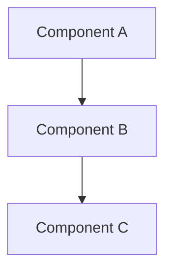

# Code Wiki Generation

## Overview

Generates a wiki for the local repo in the current working directory — project overview, architecture diagram (Mermaid), per-module docs, and getting-started guide.

**Core principle:** Only document what you can actually verify. If you're not sure, say so.

## When to Use

- User asks for a code wiki, project wiki, or repo documentation
- User wants an architecture overview or onboarding guide for a codebase
- User asks to document a project's structure or modules
- User wants a Mermaid diagram of the repo's architecture

**Do not use when:**

- User wants docs for a remote repo they haven't cloned (not supported)
- User wants class diagrams, sequence diagrams, or other advanced diagram types
- User wants interactive or web-based documentation

## Rules

Don't pretend you understand more than you do. Stick to top-level modules — no recursive deep dives unless the user asks. Every claim about the codebase must point to a real file path. If the README is garbage or the architecture is unclear, say that instead of making things up.

## Output Location

**Default:** `~/.hermes/wikis/<repo-name>/` — external to the repository.

Derive `<repo-name>` from `basename "$(pwd)"`. Only write inside the repository if the user explicitly provides an in-repo path.

## Output Structure

```text
~/.hermes/wikis/<repo-name>/
├── README.md              # Project overview
├── architecture.md        # Architecture overview (prose)
├── getting-started.md     # Setup and first-run guide
├── modules/
│   └── <module>.md        # One file per top-level module
└── diagrams/
    └── architecture.md    # Mermaid architecture diagram
```

## Procedure

Complete each step before moving to the next.

### Step 1: Determine Repo Context

```bash
basename "$(pwd)"
```

Use this as `<repo-name>`. If the directory has no recognizable source files, README, or manifest, tell the user and stop.

### Step 2: Inspect High-Signal Files

Use `search_files` to locate and `read_file` to read these categories:

1. **README / docs entrypoints** — `README*`, `CONTRIBUTING*`, `docs/`
2. **Package manifests / build files** — `package.json`, `Cargo.toml`, `pyproject.toml`, `setup.py`, `go.mod`, `pom.xml`, `build.gradle`, `Makefile`, `CMakeLists.txt`
3. **Config / setup files** — `.env.example`, `docker-compose.yml`, `Dockerfile`, config YAML/TOML files
4. **Main entrypoints** — `main.*`, `app.*`, `index.*`, `cli.*`, `run_*`, `manage.py`, `server.*`

Read the README fully. Read manifests and config files. Skim entrypoints.

### Step 3: Identify Top-Level Modules

List top-level directories, then filter to **source modules only**.

**Skip by default** — these are not primary modules unless clearly part of core architecture:

- `docs/`, `doc/`, `examples/`, `samples/`
- `tests/`, `test/`, `spec/`, `benchmarks/`
- `scripts/`, `tools/`, `bin/`
- `assets/`, `static/`, `public/`, `resources/`
- `build/`, `dist/`, `out/`, `target/`, `coverage/`
- `node_modules/`, `vendor/`, `venv/`, `.venv/`, `__pycache__/`

A directory qualifies as a module if it contains source files (`.py`, `.js`, `.ts`, `.go`, `.rs`, `.java`, etc.) and appears to implement part of the project's functionality.

If more than ~15 modules remain after filtering, document only the most prominent ones and explain which you skipped.

### Step 4: Draft Project Overview (README.md)

- Project name
- One-paragraph description (from the repo's own README, not invented)
- Primary language(s) and framework(s) (from manifests)
- Repository structure summary (top-level directories with one-line descriptions)
- Key files and their roles

If the repo's README is thin or missing, say so. Don't make up a description.

### Step 5: Draft Architecture Overview (architecture.md)

- System components and their responsibilities
- How components relate to each other
- High-level data flow (if discernible)
- External dependencies or services (if referenced in config/docker files)

Cite file paths. If you're guessing, say so.

### Step 6: Generate Architecture Diagram (diagrams/architecture.md)

Write a Mermaid flowchart into `diagrams/architecture.md`. Example:



**Rules:**

- Use `flowchart TD` or `flowchart LR` — keep it simple
- ~10-15 nodes max — group related modules when needed
- Label edges only when the relationship is not obvious
- If you're not sure about the architecture, simplify the diagram and say so in prose

### Step 7: Generate Per-Module Docs (modules/)

For each module from Step 3, create `modules/<module>.md`:

- Module name and path
- Purpose (one paragraph, from file contents)
- Key files with brief descriptions
- Relationship to other modules (if apparent)

Do not recurse into sub-packages. For large modules, note size and suggest a separate deeper dive.

### Step 8: Generate Getting-Started Guide (getting-started.md)

Derive from README, setup files, and config:

- Prerequisites (runtime, tools, deps)
- Installation / setup steps
- How to run the project and tests
- Required environment variables or config

If the repo has no setup instructions, say that. Don't guess.

### Step 9: Write Files

```bash
mkdir -p ~/.hermes/wikis/<repo-name>/modules
mkdir -p ~/.hermes/wikis/<repo-name>/diagrams
```

Use `write_file` for each output file. List the result:

```bash
find ~/.hermes/wikis/<repo-name>/ -type f | sort
```

Report the output location and file list to the user.

## Large Repo Handling

If the repo has more than ~20 top-level directories or the tree is very deep:

1. Warn the user that full documentation is not feasible in one pass
2. Document only the most prominent modules
3. List what you skipped and why
4. Suggest the user request deeper docs for specific modules

Partial honest docs beat complete bullshit docs.

## Mermaid Pitfalls

- Quote node labels containing special characters
- Keep labels short
- Max ~15 nodes — group aggressively
- Stick to `flowchart` — no `classDiagram`, `sequenceDiagram`, or other complex types
- Validate syntax before writing

## Verification

After generating the wiki:

- [ ] All output files exist in the target directory
- [ ] README.md has a project description and structure summary
- [ ] architecture.md cites concrete file paths
- [ ] diagrams/architecture.md contains valid Mermaid syntax
- [ ] Each module doc corresponds to a real source directory
- [ ] getting-started.md references actual setup files
- [ ] Nothing made up — every claim traces to a file you actually read
- [ ] Output is outside the repo (unless user requested otherwise)
